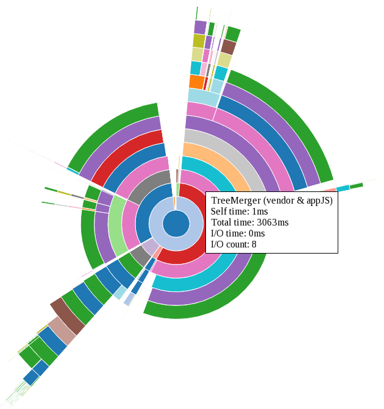

## Installation

`npm install -g broccoli-viz-sunburst`

### Requirements

* Node.js v4 or higher
* npm v2 or higher

## Usage

First, you must generate Ember instrumentation files during a build.  broccoli-viz-sunburst works with both older `broccoli-viz.*.json` files as well as newer `instrumentation.*.json` files.

```sh
BROCCOLI_VIZ=1 ember build
# produces broccoli-viz.0.json or instrumentation.build.0.json

BROCCOLI_VIZ=1 ember serve
# produces broccoli-viz.{buildNumber}.json or instrumentation.build.{buildNumber}.json
```

Then, you can use broccoli-viz-sunburst to create a visualization of the build data:

```sh
# If you have a broccoli-viz file.
broccoli-viz-sunburst broccoli-viz.*.json

# If you have instrumentation files.
broccoli-viz-sunburst instrumentation.*.json
```

Note that you can visualize multiple builds at once by supplying multiple file names to broccoli-viz-sunburst.

Finally, you can view your visualization(s) by opening the `dist/broccoli-viz-sunburst.html` file, either directly from disk or by visiting `/broccoli-viz-sunburst.html` if your Ember server is currently running.

### Interacting with the visualization

broccoli-viz-sunburst provides the following actions on the visualization:

* Hover over a segment to see its statistics:
  * name / label
  * "self" time — the time taken by this node only
  * total time — the time taken by this node and all its descendants
  * I/O time¹ — the time taken to perform this node's I/O operations, if any
  * I/O count¹ — the number of I/O operations performed by this node
* Click a node to zoom into it, showing only it and its children.
* Click the center of the graph to zoom out one level.
* Click the "Zoom to top" button to quickly return to the root node.
* Use the select input to choose which file to visualize.

¹ Older versions of Ember CLI may not record I/O statistics.


